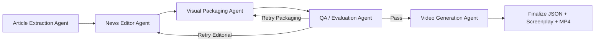

<div align="center">
  
  <h1>Algsoch News</h1>
  <p><strong>Multi-agent AI newsroom that turns a public news URL into a broadcast screenplay, visible agent workflow, and rendered video.</strong></p>
</div>

## Overview

Algsoch News is an end-to-end newsroom pipeline.

Input:

- one public article URL

Output:

- structured screenplay JSON
- segment-level visuals and timings
- visible per-agent workflow activity
- final MP4 video package

## Live Deployment

- Frontend: https://algsochnews-1.onrender.com
- Backend API: https://algsochnews.onrender.com
- Backend Swagger docs: https://algsochnews.onrender.com/api/docs

Note: `/api/docs` is a backend route. Opening `https://algsochnews-1.onrender.com/api/docs` on the frontend domain returns 404 by design.

## Input To Output

1. Article Extraction Agent fetches and cleans article content.
2. News Editor Agent converts content into timed broadcast beats and narration.
3. Visual Packaging Agent builds segment headlines, layouts, visuals, and transitions.
4. QA / Evaluation Agent scores quality and routes targeted retries when needed.
5. Video Generation Agent synthesizes audio, aligns transcript cues, and renders final video.

## What Is Different

- Visible 5-agent orchestration, not a one-shot hidden call.
- Parallel packaging logic for copy and visual prep.
- Conditional retry routing from QA back to editor/packaging.
- Broadcast-native fields such as lower thirds, ticker text, camera motion, and transitions.
- Frontend transparency for agent trace, review evidence, timeline, and control-room cues.

## 5-Agent Architecture

1. Article Extraction Agent: extraction candidate ranking and source grounding.
2. News Editor Agent: story beat shaping and anchor narration.
3. Visual Packaging Agent: copy packaging, scene layout, and visual planning.
4. QA / Evaluation Agent: rubric scoring and retry decisions.
5. Video Generation Agent: audio + transcript alignment + final render.



## Project Structure

```text
backend/
  main.py               FastAPI app and pipeline runtime
  langgraph_pipeline.py LangGraph orchestration nodes
  workflow.py           5-agent state helpers and trace events
  scraper.py            multi-source extraction and candidate scoring
  segmenter.py          story beat segmentation
  narration.py          anchor narration generation
  broadcast.py          copy packaging and transition selection
  visual_planner.py     visual planning and frame composition
  qa.py                 QA scoring and retry logic
  tts.py                audio synthesis
  video_renderer.py     FFmpeg render pipeline
  cli.py                command-line client

frontend/
  src/components/       dashboard panels and workflow UI

media/                  intermediate assets
outputs/                final artifacts per job
```

## Quick Start

### 1) Backend setup

```bash
git clone https://github.com/FiscalMindset/algsochnews.git
cd algsochnews

python3 -m venv .venv
source .venv/bin/activate
pip install -r requirements.txt
python -m playwright install chromium
```

### 2) Frontend setup

```bash
cd frontend
npm install
cd ..
```

### 3) Environment config

```bash
cp .env.example .env
cp frontend/.env.example frontend/.env
```

Set at least:

- GEMINI_API_KEY
- GEMINI_MODEL (example: gemini-2.5-pro)
- VITE_API_BASE_URL (example: `http://127.0.0.1:8000` for local dev)

### 4) Run backend

```bash
./.venv/bin/python -m uvicorn backend.main:app --host 127.0.0.1 --port 8000
```

### 5) Run frontend

```bash
npm --prefix frontend run dev -- --host 127.0.0.1 --port 5173
```

Open:

- http://127.0.0.1:5173

## CLI Guide

CLI entrypoint:

```bash
python -m backend.cli
```

If you use repo venv:

```bash
./.venv/bin/python -m backend.cli
```

### Health check

```bash
./.venv/bin/python -m backend.cli health --api http://127.0.0.1:8000
```

### Generate and wait until done

```bash
./.venv/bin/python -m backend.cli generate \
  --api http://127.0.0.1:8000 \
  --url "https://example.com/news/story" \
  --max-segments 6 \
  --transition-intensity standard \
  --transition-profile auto \
  --use-gemini \
  --wait
```

### Run locally without API server

Use this when your client should run the full pipeline directly, without `uvicorn` or `backend.main` as a web server.

```bash
./.venv/bin/python -m backend.cli local-generate \
  --url "https://example.com/news/story" \
  --max-segments 6 \
  --transition-intensity standard \
  --transition-profile auto \
  --use-gemini \
  --show-runtime-logs
```

Output includes job id, selected model, QA summary, retry decision/rounds, video path/url, and script path.

### Generate async and poll later

```bash
./.venv/bin/python -m backend.cli generate \
  --api http://127.0.0.1:8000 \
  --url "https://example.com/news/story" \
  --max-segments 6

./.venv/bin/python -m backend.cli status --api http://127.0.0.1:8000 --job-id <job_id>
```

### Full status payload

```bash
./.venv/bin/python -m backend.cli status --api http://127.0.0.1:8000 --job-id <job_id> --raw
```

### Disable Gemini for one run

```bash
./.venv/bin/python -m backend.cli generate \
  --api http://127.0.0.1:8000 \
  --url "https://example.com/news/story" \
  --no-gemini \
  --wait
```

### Useful flags

- --api: backend base URL
- --timeout: per-request timeout in seconds
- --interval: polling interval while waiting
- --wait-timeout: max total wait time
- --max-segments: valid range 4 to 12
- --transition-intensity: subtle | standard | dramatic
- --transition-profile: auto | general | crisis | sports | politics
- local-generate: in-process run, no API server required

## API Endpoints

- GET /health
- POST /generate
- GET /status/{job_id}
- GET /outputs/{job_id}/script.json
- GET /outputs/{job_id}/final_video.mp4
- GET /api/docs

## Deploy On Render

This repository includes a Render Blueprint at `render.yaml` for deploying:

- `algsoch-news-api` as a Docker web service (Python + FFmpeg)
- `algsoch-news-frontend` as a Node web service serving the Vite production build

### 1) Import the blueprint

- In Render, select **New Blueprint**.
- Point to this repository and select `render.yaml`.

### 2) Set required environment variables

For `algsoch-news-api`:

- `GEMINI_API_KEY` (required)
- `GEMINI_MODEL` (defaults to `gemini-2.5-pro`)
- `CORS_ALLOWED_ORIGINS` (comma-separated frontend origins for production; use `*` only for open dev setups)

For `algsoch-news-frontend`:

- `VITE_API_BASE_URL` = full backend URL, for example `https://algsochnews.onrender.com`

### 3) Verify deploy health

- Backend health endpoint: `/health`
- Frontend should be able to submit URL generation and stream status without same-origin assumptions.

### 4) Live environment values

- Backend `CORS_ALLOWED_ORIGINS`: `https://algsochnews-1.onrender.com`
- Frontend `VITE_API_BASE_URL`: `https://algsochnews.onrender.com`

### 5) Security note

- If any API key was previously shared in chat/logs, rotate it before production deployment.

## Generated Artifacts

For each completed job:

- outputs/<job_id>/script.json
- outputs/<job_id>/final_video.mp4
- media/<job_id>/scenes/*
- media/<job_id>/clips/*
- media/<job_id>/audio/*

## Development Notes

- On macOS, python -m compileall backend can fail on AppleDouble files such as backend/._*.py.
- Prefer targeted checks for edited modules:

```bash
./.venv/bin/python -m py_compile backend/main.py backend/langgraph_pipeline.py backend/workflow.py
```

## Maintainer

- Vicky Kumar
- GitHub: https://github.com/algsoch
- GitHub: https://github.com/FiscalMindset
- Email: npdimagine@gmail.com
