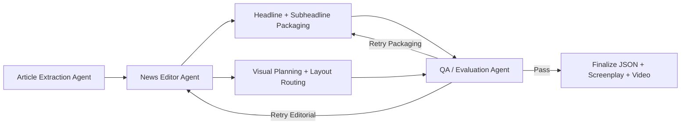

<div align="center">
  
  <h1>Algsoch News</h1>
  <p><strong>Multi-Agent AI Newsroom for turning a public news URL into a broadcast screenplay, visible agent workflow, and rendered video.</strong></p>
  <p>
    Built by <strong>Vicky Kumar</strong><br />
    GitHub: <a href="https://github.com/algsoch">@algsoch</a> · <a href="https://github.com/FiscalMindset">@FiscalMindset</a><br />
    Email: <a href="mailto:npdimagine@gmail.com">npdimagine@gmail.com</a>
  </p>
</div>

## Overview

Algsoch News is an advanced AI newsroom pipeline that takes a public news article URL and transforms it into a broadcast-style package.

Instead of returning a plain summary, the system produces:

- a structured multi-segment screenplay
- changing headlines, subheadlines, tags, and visual layouts
- agent-by-agent workflow visibility for the client
- QA scoring with retry logic
- a synced control-room style frontend
- rendered video output with audio, transitions, and scene composition

## What Makes This Project Different

- Visible 4-agent workflow instead of a hidden one-shot response
- Parallel packaging logic for copy generation and visual preparation
- Conditional QA routing that retries weak editorial or packaging steps
- Broadcast-specific output fields such as lower thirds, ticker text, transitions, and camera motion
- Human-readable screenplay plus structured JSON output
- Frontend views for live activity log, transcript cues, rundown, timeline, and final video

## 4-Agent Newsroom Architecture

1. **Article Extraction Agent**Fetches the article, cleans the text, ranks extraction candidates, and collects source images.
2. **News Editor Agent**Builds story beats, generates anchor-style narration, and shapes the editorial flow.
3. **Visual Packaging Agent**Creates segment headlines, subheadlines, tags, layouts, lower thirds, ticker text, support visuals, and scene composition.
4. **QA / Evaluation Agent**
   Scores the package, checks quality, and triggers targeted retries only where needed.



## Client-Facing Experience

The frontend is designed so a client can see how the system thinks, not just what it outputs.

The UI exposes:

- extraction status and extraction candidate ranking
- editorial progress and story-beat generation
- packaging decisions for visuals and headlines
- QA scorecards and retry outcomes
- a live control-room panel synced to the video
- transcript cues and editorial rundown
- a visual segment timeline with active playhead

## Output Format

The generated `script.json` is designed for real broadcast packaging, not a basic summary payload.

Example shape:

```json
{
  "article_url": "https://example.com/news/story",
  "source_title": "Massive Fire Breaks Out in City Market",
  "video_duration_sec": 75,
  "segments": [
    {
      "segment_id": 1,
      "start_timecode": "00:00",
      "end_timecode": "00:10",
      "layout": "anchor_left + source_visual_right",
      "main_headline": "Major Fire Hits Market",
      "subheadline": "Emergency crews rush to crowded commercial zone",
      "top_tag": "BREAKING",
      "lower_third": "Major Fire Hits Market | Emergency crews rush",
      "ticker_text": "Breaking: Fire breaks out in crowded market area",
      "camera_motion": "push_in",
      "transition": "cut",
      "control_room_cue": "Hold anchor on the left and pace this beat with a push in move."
    }
  ],
  "live_transcript": [],
  "rundown": []
}
```

## Key Features

- Multi-extractor scraping with candidate scoring
- Story segmentation into timed beats
- Anchor-style narration generation
- Segment-wise headline and subheadline generation
- Source-image preference with AI support visual fallback
- Scene image composition for each segment
- Audio synthesis and video rendering
- Transition-aware FFmpeg stitching
- QA review with conditional retry decisions

## Tech Stack

- **Backend:** FastAPI, Python, Pydantic
- **Orchestration:** LangGraph + LangChain with Gemini structured outputs
- **Frontend:** React, Vite
- **Media Pipeline:** FFmpeg, Pillow
- **Content Extraction:** newspaper3k, readability-lxml, BeautifulSoup
- **AI Refinement:** Gemini (model verified at runtime)
- **TTS:** gTTS / pyttsx3 fallback flow

## Project Structure

```text
backend/
  main.py               FastAPI entrypoint and pipeline orchestration
  workflow.py           visible 4-agent workflow state
  scraper.py            multi-source extraction and scoring
  segmenter.py          story beat segmentation
  narration.py          anchor narration generation
  broadcast.py          broadcast packaging helpers
  visual_planner.py     scene planning and image composition
  qa.py                 scoring and retry decisions
  tts.py                audio synthesis
  video_renderer.py     FFmpeg-based final render pipeline

frontend/
  src/
    Dashboard.jsx
    components/
    hooks/

media/                  generated scene images and intermediate media
outputs/                final videos and screenplay JSON
```

## Quick Start

### 1. Clone and set up Python

```bash
git clone https://github.com/FiscalMindset/algsochnews.git
cd algsochnews
python3 -m venv venv
source venv/bin/activate
pip install -r requirements.txt
```

### 2. Set up the frontend

```bash
cd frontend
npm install
cd ..
```

### 3. Configure environment variables

Create a local `.env` from `.env.example`.

```bash
cp .env.example .env
```

### 4. Run the backend

```bash
# from the repository root
./venv/bin/uvicorn backend.main:app --host 0.0.0.0 --port 8000 --reload
```

### 5. Run the frontend

```bash
cd frontend
npm run dev
```

Open the frontend URL shown by Vite, usually:

```text
http://localhost:5173
```

If `5173` is busy, Vite will automatically move to another port such as `5174`.

## Environment Variables

| Variable               | Purpose                                    | Example / Default    |
| ---------------------- | ------------------------------------------ | -------------------- |
| `GEMINI_API_KEY`     | Gemini API access for editorial refinement | `your_key_here`    |
| `GEMINI_MODEL`       | Gemini model name                          | `gemini-2.5-pro` |
| `USE_GEMINI`         | Enable or disable Gemini refinement        | `true`             |
| `TTS_ENGINE`         | Preferred TTS engine                       | `gtts`             |
| `OUTPUT_DIR`         | Final generated assets directory           | `./outputs`        |
| `MEDIA_DIR`          | Intermediate scene/media directory         | `./media`          |
| `MAX_ARTICLE_LENGTH` | Max article length for processing          | `15000`            |
| `VIDEO_WIDTH`        | Video width                                | `1280`             |
| `VIDEO_HEIGHT`       | Video height                               | `720`              |
| `VIDEO_FPS`          | Target FPS                                 | `24`               |
| `WORDS_PER_SECOND`   | Narration timing estimate                  | `2.5`              |
| `QA_THRESHOLD`       | QA threshold tuning value                  | `0.6`              |
| `MAX_RETRIES`        | Max QA retry rounds                        | `2`                |

## API Endpoints

| Method   | Endpoint                              | Description                                  |
| -------- | ------------------------------------- | -------------------------------------------- |
| `GET`  | `/health`                           | Health and version check                     |
| `POST` | `/generate`                         | Start a generation job                       |
| `GET`  | `/status/{job_id}`                  | Poll workflow status, agents, QA, and result |
| `GET`  | `/outputs/{job_id}/final_video.mp4` | Download or stream final video               |
| `GET`  | `/outputs/{job_id}/script.json`     | Download structured screenplay JSON          |

## Generated Artifacts

Each completed job writes output like:

- `outputs/<job_id>/final_video.mp4`
- `outputs/<job_id>/script.json`
- `media/<job_id>/scenes/*.jpg`
- `media/<job_id>/clips/*.mp4`

## Development Notes

- `.env`, `venv/`, `frontend/node_modules/`, `media/`, and `outputs/` are intentionally excluded from git.
- The app can still render if a local FFmpeg build lacks some advanced text-overlay capabilities because the scene graphics are composed ahead of video render.
- In restricted environments, online TTS providers may fail and fall back to silent placeholder audio.
- The current workflow is built as a visible Python orchestration layer with agent traces, retries, and conditional routing.

## Maintainer

**Vicky Kumar**

- Personal GitHub: [@algsoch](https://github.com/algsoch)
- Project / publishing account: [@FiscalMindset](https://github.com/FiscalMindset)
- Email: [npdimagine@gmail.com](mailto:npdimagine@gmail.com)
